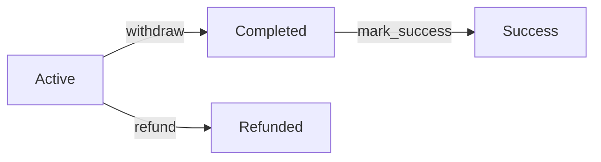

# 🔒 Token Escrow Contract

Secure token escrow with deposit, withdrawal, refund, and success confirmation on Solana.

## 🎯 How It Works

```
Alice (Depositor) ──► [Escrow Vault] ──► Bob (Recipient)
        │                 │                     │
        │                 │                     │
    deposit()         refund()              withdraw()
     tokens            tokens               tokens
        │                 ▲                     │
        │                 │                     │
        └─────────── mark_success() ◄───────────┘
```

## 📋 Functions

| Function | Who | What |
|----------|-----|------|
| `deposit(amount)` | Alice | 🔒 Lock tokens for Bob |
| `withdraw()` | Bob | ✅ Claim the tokens |
| `refund()` | Alice | ❌ Get tokens back |
| `mark_success()` | Alice/Bob | 🎉 Confirm success |

## 🔄 State Flow



## 🚀 Quick Start

```bash
# Install & Build
anchor build

# Test  
anchor test

# Deploy
anchor deploy --provider.cluster devnet
```

## 💻 Usage

```typescript
// 1. Create escrow
await program.methods
  .deposit(new BN(1000))
  .accounts({
    depositor: alice.publicKey,
    recipient: bob.publicKey,
    // ...
  })
  .signers([alice])
  .rpc();

// 2. Withdraw tokens
await program.methods
  .withdraw()
  .accounts({
    recipient: bob.publicKey,
    // ...
  })
  .signers([bob])
  .rpc();

// 3. Mark success
await program.methods
  .markSuccess()
  .accounts({
    signer: alice.publicKey, // or bob.publicKey
    // ...
  })
  .signers([alice])
  .rpc();
```

## 🔐 Security Features

### **PDA Authority**
```
Escrow Vault Owner = PDA(seeds: [b"escrow", alice, bob])
```
No human has private keys → **No rug pulls possible**

### **Access Control**
- **Withdraw:** Only Bob can claim
- **Refund:** Only Alice can reclaim  
- **Success:** Only Alice or Bob can confirm

### **Status Tracking**
```rust
pub enum EscrowStatus {
    Active,     // 🔒 Funds locked
    Completed,  // ✅ Withdrawn
    Refunded,   // ❌ Refunded
    Success,    // 🎉 Confirmed
}
```

## 🎓 Key Learning Concepts

### **CPI Patterns**
```rust
// Human signs (deposit)
CpiContext::new(program, accounts)

// PDA signs (withdraw/refund)
CpiContext::new_with_signer(program, accounts, seeds)
```

### **PDA Signing**
```rust
let seeds = &[
    b"escrow", 
    depositor.as_ref(), 
    recipient.as_ref(), 
    &[bump]
];
```

### **Events for Tracking**
```rust
#[event]
pub struct EscrowCreated {
    pub escrow: Pubkey,
    pub amount: u64,
}
```

## 🏗️ Architecture

```
┌─────────────┐    ┌─────────────┐    ┌─────────────┐
│ Depositor   │    │   Escrow    │    │  Recipient  │
│   ATA       │───▶│   Vault     │───▶│     ATA     │
└─────────────┘    └─────────────┘    └─────────────┘
                          │
                          │ (PDA Authority)
                          ▼
                   ┌─────────────┐
                   │   Program   │
                   │   Signs     │
                   └─────────────┘
```

## 🧪 Test Coverage

- ✅ Happy path flows
- ❌ Unauthorized access
- 🔄 Status transitions  
- 🎯 Edge cases
- 📊 Balance verification

## 📊 Account Structure

```rust
pub struct Escrow {
    depositor: Pubkey,      // Who deposited
    recipient: Pubkey,      // Who receives
    amount: u64,           // Token amount  
    status: EscrowStatus,  // Current state
    bump: u8,             // PDA bump
}
// Total: 82 bytes
``

**🚀 Production-ready • 🔐 Secure by design • 📚 Educational**